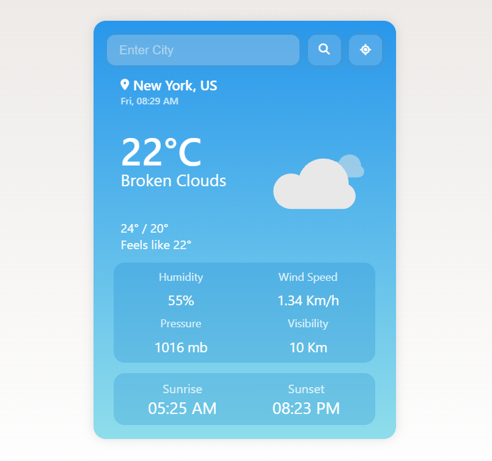
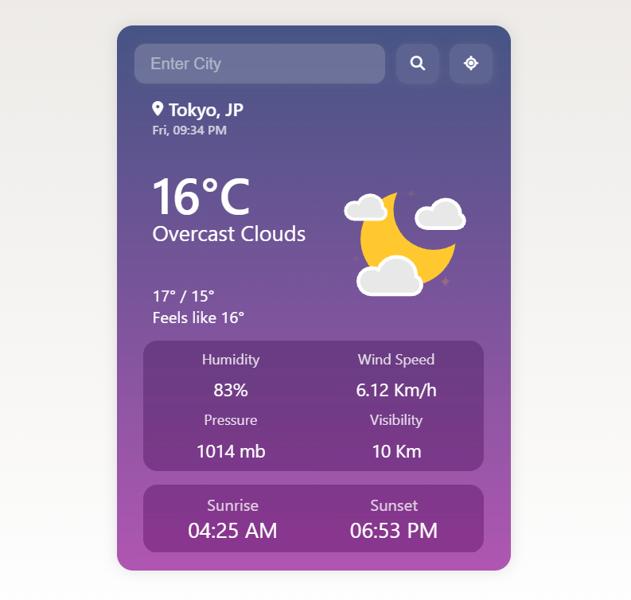
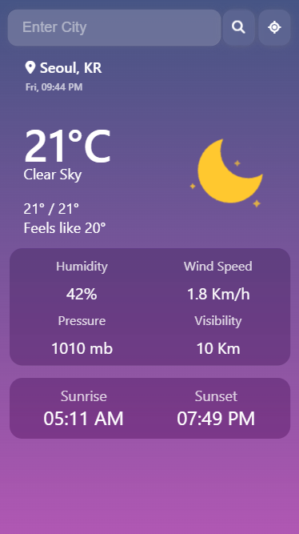

# Climate Canvas 🌦️
I built Climate Canvas while learning JavaScript and working with APIs. It started as a simple weather search project, but I kept adding features that felt useful and interesting to build.

The app lets you search for weather anywhere in the world or use your current location. One thing that bothered me in many beginner weather apps was that they showed the weather for a city but still displayed my own local time. I wanted the experience to feel more realistic, so I added a live clock that updates using the selected city's timezone.

Along the way I experimented with geolocation, local storage, dynamic themes, loading states, and weather animations. The app automatically switches between day and night themes based on sunrise and sunset data, and weather conditions are visualized with Lottie animations.

### What it can do 🎯

* Search weather by city name
* Get weather using your current location
* Display live local time for the selected city
* Automatically switch between day and night themes
* Show animated weather conditions
* Save recently searched cities using Local Storage
* Handle loading and error states
* Adapt to mobile and desktop screens

### Built With 🔍

* HTML
* CSS
* JavaScript
* OpenWeather API
* Lottie Animations

### What I Learned 📚

Building this project gave me hands-on experience with:

* Working with APIs and asynchronous JavaScript
* Handling timezone calculations
* Using the Geolocation API
* Managing Local Storage
* Creating responsive layouts
* Building dynamic user interfaces with DOM manipulation
* Improving user experience with loading states and animations

There are still a few ideas I'd like to explore in the future, such as a multi-day forecast and hourly weather data, but this version represents a complete project that helped me become much more comfortable building real-world applications with vanilla JavaScript.

### Desktop View 🌅

### Night Theme 🌇

### Mobile View 📱

